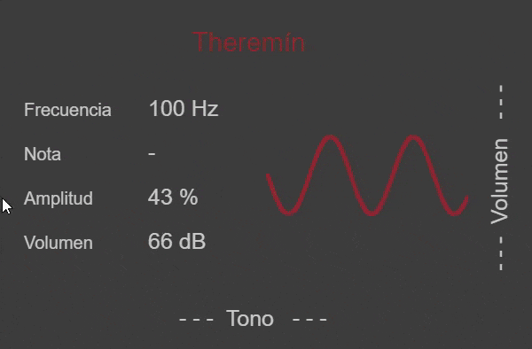

# :musical_note: [Theremin](https://editor.p5js.org/JuanRP/present/Lb6MS2vb "Theremin Web App")
An online Theremin made with p5.js

## Folders
- **web**: CSS and JavaScript code for the online Theremin.
- **python**: Some data formatting for the notes and frequencies.
